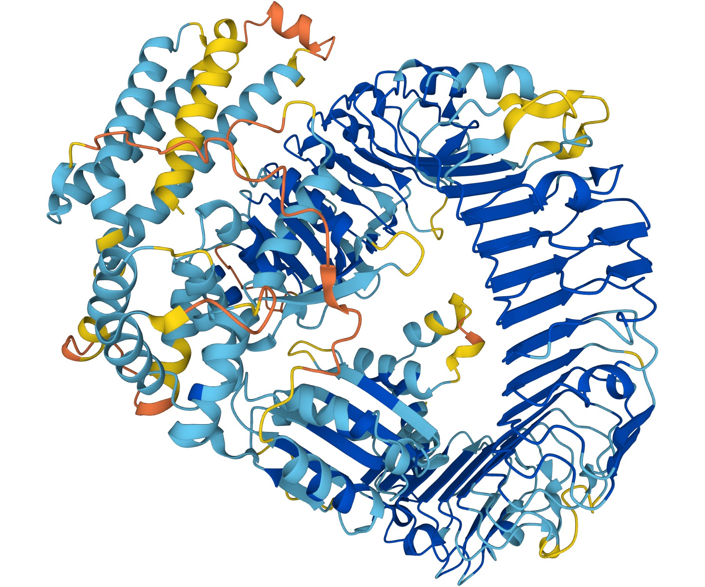

# An Exploration of AlphaFold: CS 4501 Final Project Fall 2022  
We have set out to make a fun (for us to do, and for others to see), useful (at least to us, but hopefully to you and others), relevant (to the class, to us, to humanity), and technically interesting project exploring an innovative program called AlphaFold.  
  
Project Members: Asheeta Bothra (<ab3wjt@virginia.edu>), Emily Kao (<eck3pxj@virginia.edu>), Meesha Vullikanti (<rv6cun@virginia.edu>)  
1. [About the project](https://eckao.github.io/compbio-alphafold-project/about)  
2. [Proteins and the Protein-Folding Problem](https://eckao.github.io/compbio-alphafold-project/proteinstructures)
3. [What is AlphaFold?](https://eckao.github.io/compbio-alphafold-project/alphafold)
4. [Limitations of AlphaFold](https://eckao.github.io/compbio-alphafold-project/shortcomings). 
5. [Identifying Sequence Motifs to Better Predict Folding](https://eckao.github.io/compbio-alphafold-project/bindingmotifs)
6. [References](https://eckao.github.io/compbio-alphafold-project/references)  

  
