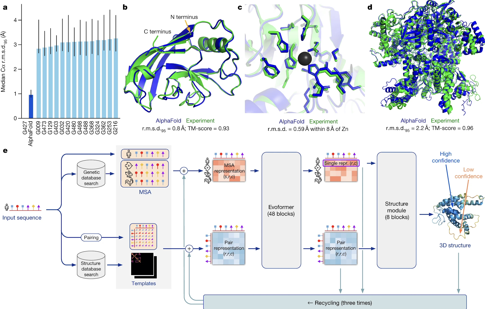

# What is AlphaFold?
## How does AlphaFold work?
Alphafold uses 3 primary inputs derived from the input sequence to determine the final output.  
1. Multiple Sequence Alignment. First is the multiple sequence alignment (MSA) for the input sequence. These are sequences that are evolutionarily related to the target sequence and are found by searching several publicly available databases, including Big Fantastic Database (BFD) which was custom-made and has now been released publically. Other databases included the Protein Database (PDB) and Uniref90. For a reasonably accurate protein structure, at least 30 sequences must be included in the MSA.  
2. Residue Pairs. The input sequence residues are paired against eachother in a matrix that represents the distance between residues.  
3. Templates. These are protein database structures that are expected to be similar to the target sequence. These templates also feed into the MSA and residue pair arrays. Templates are most helpful when the MSA is small, and not every model requires a template.  

These 3 inputs are then fed into several blocks that are collectively called “evoformer”, which is built upon concepts of transformers and attention. The MSA and pair representations are repeatedly updated until they contain highly informative values about structure. The evoformer is run 48 times in total.  

Next, the MSA and pair representation are fed through the structure model, which predicts a rotation and translation for each individual residue. The chi angles (or bond angles) between residues are predicted and a chain is formed here. This produces a structure that is biologically feasible, but to ensure that any violations of biological principles are removed, the structure is run through a relaxation step, which focuses on energy minimization and a low-entropy state.  

This final output can be fed through the machine again for more accurate structures.  

In addition to the final structure, Alphafold outputs 2 confidence metrics.  
1. Predicted lDDT. This is the Alphafold prediction of per-residue local distance difference test (lDDT), which is closely related to lDDT. This measures percentage of correctly predicted interatomic distances and is represented both through a colored diagram of the final structure where the final structure is colored by confidence bands and a line chart. Values may range from 1-100, where a higher p indicates greater confidence in the structures. Predicted lDDT is used to identify protein domains and potentially disordered regions or to assess confidence within a domain. It is less useful for understanding confidence in relative positions of domains.  
2. Predicted Aligned Error (PAE). This measures confidence in the lreative positions of the pairs of residues. This is used to assess relative domain position but is applicable whenever pairwise confidence is relevant. The PAE is represented as a 2D plot with residue numbers on the axis. A high value indicates lower confidence. Domain structure is visible in areas with higher confidence relative to other areas.

Image Source: https://www.nature.com/articles/s41586-021-03819-2

## AlphaFold 1 and AlphaFold 2
AlphaFold 1 was DeepMind's initial foray into the CASP competitions. AlphaFold 1 was entered into the CASP13 competition in which it successfully predicted more FM domains with high accuracy than any other systems competing in CASP13. AlphaFold 2 is the second iteration of a protein predicting program from DeepMind. The results of AlphaFold 2 in CASP 14 was an even more impressive feat in which AlphaFold 2 vastly outperformed the 145 entrants in the competition. Approximately two-thirds of AlphaFold 2's predictions in this competition were comparable in quality to experimental structures and some were almost indistinguishable from experimental results. 
