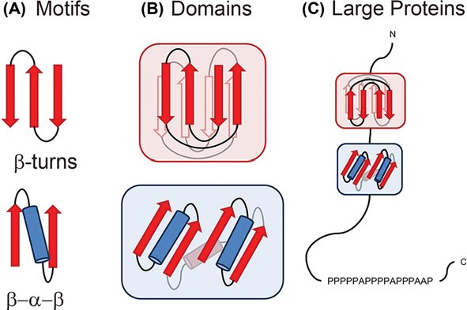
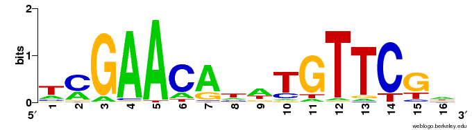
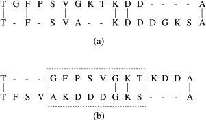
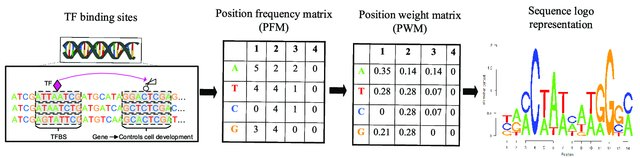
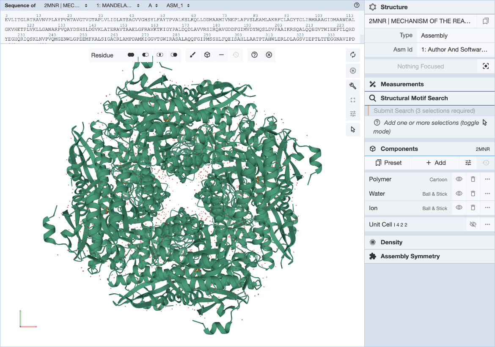

# Identifying Sequence Motifs to Better Predict Folding  
Different proteins are related structurally and functionally to eachother through protein motifs, or small shared regions of protein structure of amino acid sequences. These motifs are frequently, but not always, defined by a unique chemical or biological function. Many enzymatic active sites are motifs. An example include INSERT EXAMPLE HERE. Protein domains are functionally similar regions that appear in many different proteins, such as the calcium-binding region of many different proteins modulated by Ca2+. Genes that encode proteins with similar domains are referred to as a gene family. We can swap protein domains through genetic engineering to create freak chimeric proteins with novel functions based on the known activity of different protein domains.

  
        
</p">

Taken from https://www.researchgate.net/publication/344391925_Uncovering_protein_structure.
</p">

Sequence motif algorithms are used to describe and identify sequences that are structurally or functionally similar across a number of different sequences. These algorithms help us find patterns in biopolymer sequences, such as nucleotide or amino acid sequences.  

   
  
</p">

  Taken from https://en.wikipedia.org/wiki/Sequence_logo.  

 

Biological sequence motifs are presented either as regular expressions (RE) or position weight matrices (PWM)
- RE – a way to describe sequence patterns by defining a a sequence expression that a sequence motif would match. 
- PWMs – define the probability of each letter in the alphabet occurring at that position. This is just an n * w matrix, where n is the number of letters in the sequence alphabet and w is the number of positions in the motif. Pi,j is the probability of letter i occurring at position j in the motif. The probability of a full sequence is the product of the corresponding entries in the PWM. 

  
  . 
</p">

  Taken from https://www.sciencedirect.com/science/article/pii/S1570866707000032.  

  

  Taken from https://www.researchgate.net/publication/347760573_A_Review_About_Transcription_Factor_Binding_Sites_Prediction_Based_on_Deep_Learning.  

There are a few different techniques for motif discovery. These algorithms only find statistically significant sequences, not necessarily biologically relevant sequences. 
focused approach – assemble a set of sequences and search for over-represented patterns in the sequence relative to a baseline or background sequence 
- focused discriminative approach – assemble two sets of sequences and look for over-represented patterns in one of the sets
- phylogenetic approach – uses sequence conservation information about the sequences in a single input set
- whole-genome approach – looks for over-represented, conserved patterns in multiple alignments of the genomes of 2+ species 

Application of motif discovery algorithms follows the same few general steps regardless of the algorithm
- Assemble the set by selecting relevant target sequences. How you assemble your input sequence set depends on the types of motifs you’re looking for and where you expect them to occur. First, we cluster amino acid sequences or other sequences based on information about coexpression, cobining, function, environment, or orthology, and then we extract relevant sequences
- Clean the set by masking or removing “noise”
- Run the motif discovery algorithm
- Evaluate the results of the algorithm through an investigation of the biological function and relevance of the motifs the algorithm returns

Sequence motif discovery algorithms are limited in a few ways. Motif discovery is basically a “needle-in-a-haystack” endeavour, where the motif is the needle and the sequences are the haystack. Because of this, it’s almost impossible to find motifs if they’re not overrepresented in the input set. Less common motifs are essentially lost as a result. 

Structural motifs require a bit more effort as a result of the non-continuous nature of the amino acid sequences that make up the total motif, and require a completely natively folded protein structure for identification. This can be time-intensive and difficult to obtain, and it is this gap in knowledge that Alphafold seeks to bridge. 

    

  Taken from https://www.rcsb.org/docs/search-and-browse/advanced-search/structure-motif-search.  

  

Sequence and structure-based motif identification methods are limited by the fact that a single motif could be represented by many different binding patterns or that biologically relevant motifs might not exist as a contiguous amino acid sequence within a larger polypeptide chain due to protein folding that creates different protein domains. 

