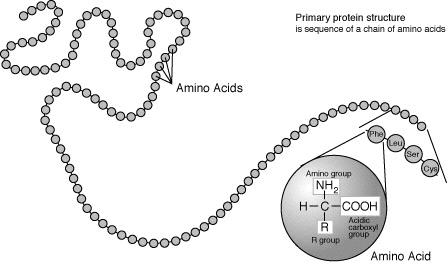
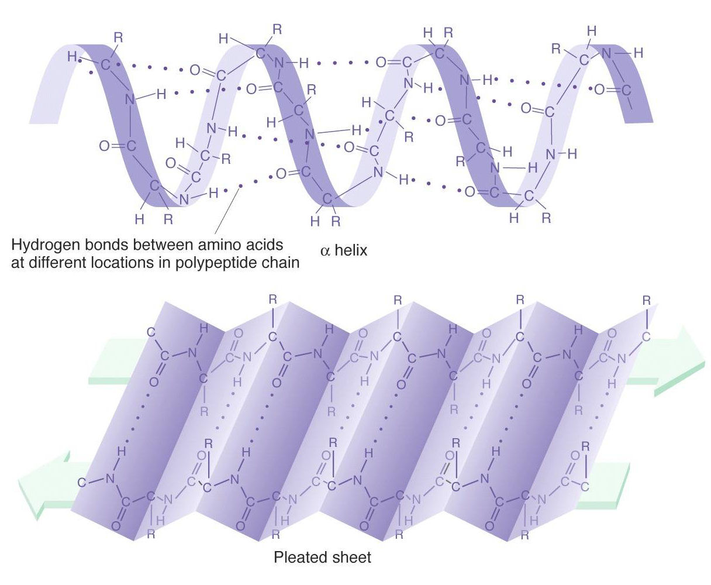
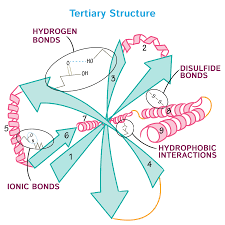

# Proteins and the Protein-Folding Problem
## What is a protein? 
Proteins are biomolecules made up of amino acids, the sequence of which determines the structure and function of each protein. In biological systems, proteins play complex and critical roles, and are largely responsible for structure, function, and regulation of a system’s tissues and organs. You have likely heard of enzymes which are catalysts for important chemical reactions--these are also proteins! 

## Orders of protein structure
### 1. Primary
Primary structure is the sequence of amino acids making up a polypeptide chain. 

Amino acids usually have the following structural properties:
- A carbon (the alpha carbon) bonded to the four groups below:
- A hydrogen atom (H)
- A Carboxyl group (-COOH)
- An Amino group (-NH2)
- A "R" group or "variable" group  

### 2. Secondary
Secondary structure is local folded structures that form within a polypeptide resulting from interactions between atoms of the backbone. The backbone refers to the polypeptide chain not including the R group.  

There are two types of secondary structures seen in proteins.
- alpha (α) helix - looks like a coiled spring
- beta (β) pleated sheet - looks like its folded or pleated 

### 3. Tertiary
Tertiary structure results from interactions between the R groups of the amino acids that make up the protein. This is the overall three-dimensional structure of a polypeptide. 
- Non-covalent bonds influencing interactions:
  - hydrogen bonding
  - ionic bonding
  - dipole-dipole interactions
  - London dispersion forces 
  - Hydrogen bonding 
- Hydrophobic interactions
  - nonpolar, hydrophobic R groups cluster on inside of protein, while hydrophilic amino acids are on the outside interacting with surrounding water
- Covalent bond
  - Disulfide bond are covalent linkages between sulfur-containing side chains of cysteines
    - Stronger than the other types of bonds that contribute to tertiary structure

### 4. Quaternary
While many proteins are made of a singular polypeptide chain and have three structural levels, some are made up of multiple chains or subunits. When the subunits come together, a protein gets its quaternary structure. The types of interactions that are part of tertiary structures are usually the same ones that hold subunits together that give proteins quaternary structure. This involves interactions such as London disperson forces and hydrogen bonding.  

## The Protein Folding Problem  
The protein-folding problem first emerged around 50 years ago, and consists of three general questions:
1. The folding code: what is the code that determines a protein's structure for a given amino acid sequence?
2. The folding mechanism: what is the process that allows proteins to fold quickly?
3. Protein structure prediction: can we formulate a computer algorithm to predict the native structure of a protein from its amino acid sequences?

The idea of a folding problem came up in 1960 with the first appearance of atomic-resolution protein structures. There had been some expectation of internal crystalline regularity, and Linus Pauling had predicted the presence of α-helices. However, the first protein structures to be realized were globins, and they unexpectedly had helices packed together irregularly. 

In his thermodynamic hypothesis, Anfinsen proposed that the native structure of a protein is in fact the thermodynamically stable structure. With this, Anfinsen stated that the structure of a protein solely depends on the amino acid sequence and the conditions of the solution rather than the folding route. This led to two notable conclusions in protein science, as it 1) facilitated research of in vitro protein folding and 2) implied that evolution can alter amino acid sequences, but the folding equilibrium and kinetics of sequences are related to chemistry. 

In the 1980s, statistical mechanical modeling led to the emergence of a new view on the protein folding code in which the hydrophobic interaction is the dominant component. There are a number of points that justify this new theory: 1) proteins have hydrophobic cores, suggesting that nonpolar amino acids separate from water; 2) model compound studies show 1-2 kcal/mol for transferring a transferring a hydrophobic side chain from water to oil-like substances; 3) proteins easily denature in nonpolar solvents; and d) when sequences are scrambled and maintain the correct hydrophobic and polar patterns, they fold to the expected native structures.

Predicting a protein's native structure from its amino acid sequence has been a major objective as it presents the opportunity to expedite drug discovery and annotate protein function from genome sequences. Previous uses of protein databases to achieve this included secondary structure prediction algorithms, computational physics involving atomic force fields and Monte Carlo sampling, homology detection algorithms that assemble structures basedd off homologous sequences, and sequence alignment methods. The invention of CASP (Critical Assessment of Techniques for Protein Structure Prediction) in 1994 as a blind test to predict unknown protein structures, and has undergone major growth since its conception. The combination of CASP, the PDB (Protein Databank), fast-homology methods, and sequence alignment methods now means that the native structure of small proteins can often be correctly predicted by computers.

Research into folding mechanisms has been especially important in furthering experimental and theoretical protein science. Some of the resulting advances include fast laser temperature-jump methods, expansive exploration of protein model systems, and single-molecule methods. Computation-based models emerged in the 1960s, and the Go Model was developed to find out if a computer had the ability to find the native structure if there were native guiding constraints present. This model is now widely used as a means to study and explore the folding kinetics of proteins with known native structures.

One major development of protein folding is that proteins actually fold on funnel-shaped energy landscapes. This shape implies that there are many high-energy states and fewer low-energy states, describing the conformational heterogeneity throughout nonnative states. This is essential in understanding the entropy that opposes folding and the folding equilibrium, which helps provide insight into folding kinetics as a whole.

Research into folding routes has presented the zipping and assembly (ZA) hypothesis that aims to answer Levinthal's question on what stretches of space are ignored by the preotein to allow it to fold so quickly. In the ZA hypothesis, a protein first makes independent local decisions and then combines substructures, allowing it to skip over searching much of its conformational space. This hypothesis serves as a practical search method when attempting computational modeling.
