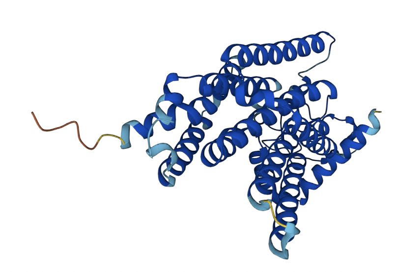
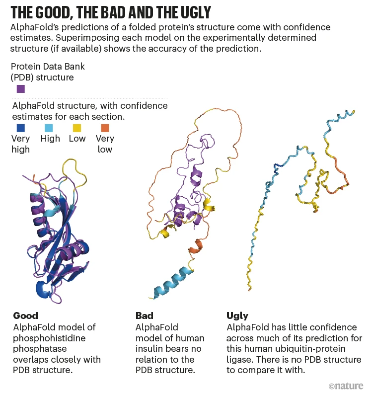

# Successes and Limitations of AlphaFold
AlphaFold 2 has revolutionized the field of protein predictions, as demonstrated by de novo predictions for the 3D structures of human glucose-6-phosphatase, diacylglycerol-O-acetyltransferase 2, and the transmembrane ER protein wolframin. Previously, no predicted or experimentally validated structure was available for any of these structures. Ultimately, AlphaFold 2 is revolutionary for monomeric proteins that have a single native structure and don't interact with other molecules in ways that impact their confomration. AlphaFold 1 and 2 have both had huge successes at the CASP13 and CASP14 competitions that demonstrate their superiority over other protein folding solutions.

  

  

  AlphaFold predicted structure for glucose-6-phosphatase. Image source: https://alphafold.ebi.ac.uk/entry/P35575

  
Despite its successes, AlphaFold 2 is still lacking in a number of ways. Approaches based on Multiple Sequence Alignments (MSA) such as AlphaFold are constrained by current knowledge and available datasets. Interactions with partner proteins and multimers are not available for prediction -- AlphaFold Multimer was recently presented and aims to address this, but is still only most successful with homomeric proteins or heterodimeric proteins. In addition to struggling to predict multiunit proteins, AlphaFold is unable to predict other aspects or components of protein structure, such as interactions with metal ions, cofactors, and other ligands or post-translational modifications such as glycosylation or phosphorylation. For natively unfolded regions or proteins with less data available for alignment, AlphaFold is unable to produce appropriate structures.  Additionally, AlphaFold used PDB for its training. However, some of the folds in the PDB only occur in special conditions, but AlphaFold will predict the folding based off of the PDB even if the special conditions do not occur which is especially an issue for proteins with multiple native structure. 

  

  

  Alphafold Confidence Metrics for Different Proteins. Image source: https://www.nature.com/articles/d41586-022-00997-5#:~:text=AlphaFold%20deploys%20deep%2Dlearning%20neural,the%20PDB%20and%20other%20databases

Moving forward, AlphaFold is anticipated to prsent even more opportunity regarding drug discovery, as drug development currently requires using structures throughout the process. The creators of AlphaFold have acknowledged these shortcomings and it is almost certain that the algorithm will continue to improve over time. 

